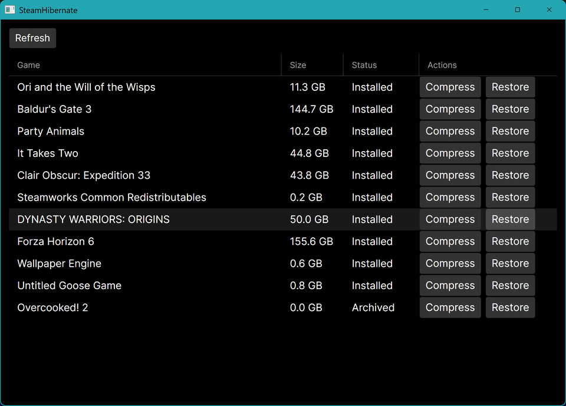

<div align="center">

# SteamHibernate

**Cold-archive Steam games you're not playing — get the disk space back, restore in minutes instead of re-downloading.**

[](https://github.com/BlackBearCC/SteamHibernate/releases)
[](#requirements)
[](https://dotnet.microsoft.com/)
[](#roadmap)



</div>

---

## The problem

Your Steam drive fills up, so you delete a game to install a new one — then re-download 100 GB next time you want to play the old one. SteamHibernate breaks that loop: it compresses games you're not playing into a single archive and **removes the original**, then restores them on demand. Restoring from a local archive takes minutes; re-downloading takes hours.

It is **Steam-aware**: it reads your libraries from the registry and `libraryfolders.vdf`, and on restore it puts the game files *and* the `appmanifest` back, so **Steam recognizes the game as installed again with no re-download and no integrity check**.

> Status: **alpha.** Manual compress/restore works and is verified on real hardware (GUI + headless CLI). Transparent auto-restore-on-launch (ProjFS) is on the [roadmap](#roadmap).

## Features

- **Compress / Restore any installed Steam game** from a GUI list or the command line.
- **Steam sees it correctly** — archived games show as *not installed*; restored games show as *Ready to Play* without a re-download.
- **Stores archives inside the game's own Steam library by default** (same drive) — since the original is deleted, this nets a saving rather than costing extra space. Configurable.
- **Never loses a game**: commit-on-success everywhere — the original is deleted only after the archive is built *and* verified.
- **Live progress** with per-game progress bar and percentage.
- **Pluggable compression engines**, fully open-source default stack.
- **Self-contained installer** — bundles the .NET runtime, 7-Zip and precomp; no prerequisites.

## Install

Download the latest **`SteamHibernate-Setup-x.y.z.exe`** from the [**Releases**](https://github.com/BlackBearCC/SteamHibernate/releases) page and run it. It installs to Program Files with a Start Menu (and optional desktop) shortcut and an uninstaller. Administrator rights are required (it moves files under your Steam folder).

## Usage

**GUI** — launch SteamHibernate. You get a list of your games (name, size, status) with per-row **Compress** and **Restore** buttons and a live progress bar.

**Command line** (scriptable, no display needed):

```text
SteamHibernate.App.exe list                 # list installed + archived games
SteamHibernate.App.exe compress <appid>     # archive a game
SteamHibernate.App.exe restore  <appid>     # bring it back
```

> Tip: do compress/restore with **Steam closed**, or expect a one-time Steam Cloud "couldn't sync saves" prompt — changing game files under a running Steam confuses its save reconciliation. The files are fine; choose to proceed.

## How much space will I save?

Honest answer: **it depends on the game, and it's not magic.** Modern game assets (textures, audio, video) ship *already compressed*, and no general-purpose compressor beats that entropy floor.

| Game type | Typical saving |
|---|---|
| Modern AAA / Unity / Unreal-Oodle (assets pre-compressed) | ~10–35% |
| Older / indie / loosely-packed (uncompressed or zip/deflate data) | ~40–60% |

Measured example: *Overcooked! 2* (Unity) → **7.9 GB to 5.4 GB** (~32%).

**The real win is moving big games off your drive entirely** (100% reclaimed there) and getting them back in minutes — not shrinking each game to a tenth.

## Compression engines

- **Default — 7-Zip LZMA2 (solid).** Robust, good ratio, fast.
- **Optional — precomp + LZMA2 (`.pc7z`), off by default.** `precomp` losslessly expands zlib/deflate streams so LZMA can recompress them — it helps **deflate/zip-packed** games. It is **counterproductive on already-compressed games** (Unity/Oodle): measured on *Overcooked! 2*, precomp gave `5.9 GB / 10 min` vs plain `5.4 GB / 4 min` — bigger *and* slower. Enable it per game only when a game uses deflate packing.

Archives are self-identifying (`.7z` vs `.pc7z`) and always restore with the engine that created them. The default stack (precomp + 7-Zip/xz) is fully open source; `srep` is deliberately **not** bundled (closed-source freeware).

## Safety — never lose a game

Every state change is **commit-on-success**, never try-then-rollback:

- **Compress**: pack → verify integrity (precomp engine also dry-run-restores the data) → **only then** delete the original folder + appmanifest. Metadata is committed before the original is removed. Any failure leaves the original untouched.
- **Restore**: extract to a temp dir on the same volume → atomic move into place → restore appmanifest → clear the record. Any failure leaves the archive intact.

Corrupt config/metadata is surfaced, never silently reset.

## Architecture

A small, layered .NET 8 solution. All logic lives in a UI-free, cross-platform-testable core library; the GUI only displays and forwards commands.

```
SteamHibernate.Core/
  Vdf/        Valve KeyValues parser
  Steam/      locate Steam + libraries, scan installed games & last-played
  Engine/     IArchiveEngine + SevenZipEngine, PrecompLzmaEngine, EngineFactory
  Package/    GamePackage (data + appmanifest + manifest + header)
  Metadata/   JSON archive index (atomic writes)
  Tiering/    ManualTieringService (commit-on-success compress/restore)
  Config/     AppConfig + ConfigStore
SteamHibernate.App/   Avalonia GUI + headless CLI
tests/                xUnit (round-trips run against real 7-Zip/precomp)
installer/            Inno Setup script
```

## Build from source

Requirements: .NET 8 SDK. A 7-Zip executable on `PATH` enables the engine round-trip tests.

```bash
dotnet build
dotnet test                                   # 7-Zip tests run if 7z is available
PRECOMP_PATH=/path/to/precomp dotnet test     # also runs the precomp round-trip test

# Self-contained Windows build (no .NET needed on the target):
dotnet publish src/SteamHibernate.App -c Release -r win-x64 --self-contained true -o out

# Build the installer (Windows, Inno Setup): stage = publish output + 7za.exe + precomp.exe
ISCC.exe /DStageDir=<stage> installer\SteamHibernate.iss
```

## Configuration

`%AppData%\SteamHibernate\config.json`:

| Key | Meaning | Default |
|---|---|---|
| `ArchiveRoot` | Where archives are stored (empty = inside each game's Steam library) | empty (per-library) |
| `CompressionLevel` | LZMA2 level 1–9 | `9` |
| `SevenZipPath` | Path to the 7-Zip exe | auto-detect (incl. app folder) |
| `EnablePrecomp` | Use the precomp engine | `false` |
| `PrecompPath` | Path to the precomp exe | auto-detect (incl. app folder) |
| `IdleDays` | "Cold" threshold (for future auto-tiering) | `30` |

## Caveats

- **Anti-cheat games** (EAC / BattlEye / Vanguard) are best left alone with archive/restore; planned auto-tiering will exclude them.
- Restoring a game while Steam is running triggers a one-time Steam Cloud sync prompt (see [Usage](#usage)).

## Roadmap

- **Auto restore on launch (ProjFS).** The smooth experience: archived games keep showing **Play** in Steam via a projected-filesystem placeholder; clicking Play auto-restores (hydrates) the game, and idle games auto-archive. Compress can be manual or automatic; **restore is always automatic**. Gated on a spike proving a ProjFS placeholder makes Steam show Play without a re-download (the platform — Windows 11, ProjFS — is confirmed ready).
- Settings UI, deflate auto-detection for the precomp engine, archive reclamation after restore.

## Contributing

Issues and pull requests are welcome. Run `dotnet test` before submitting; engine round-trips and the tiering safety tests should stay green.

## License

Not yet chosen — a `LICENSE` file will be added before wider distribution. The bundled compression tools (precomp, 7-Zip/xz) are open source; `srep` is intentionally not included.

## Acknowledgements

[7-Zip](https://www.7-zip.org/) · [precomp](https://github.com/schnaader/precomp-cpp) · [Avalonia](https://avaloniaui.net/) · [Inno Setup](https://jrsoftware.org/isinfo.php)
